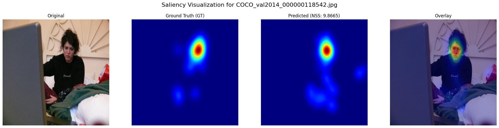
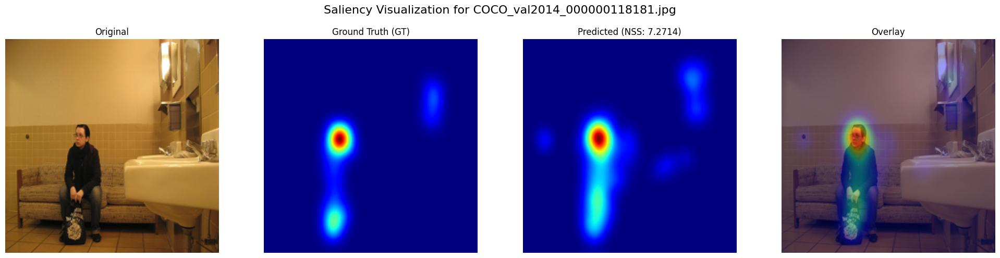
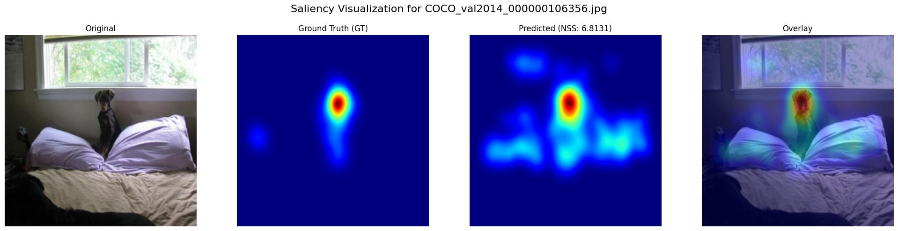
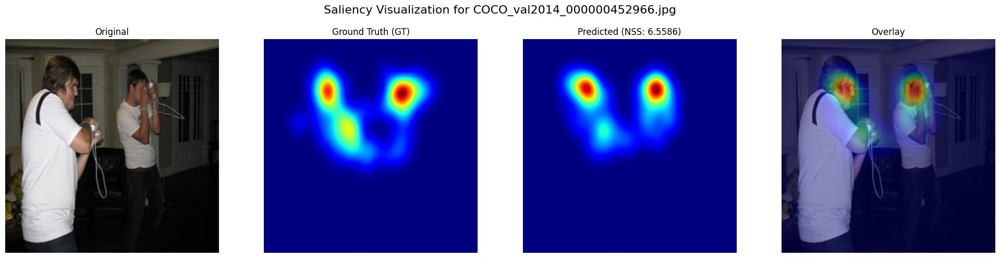
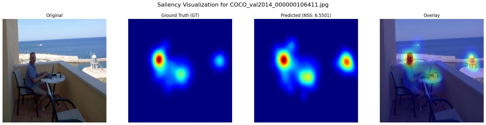
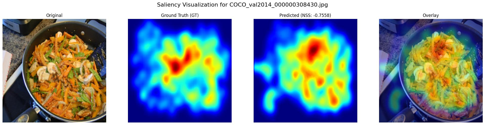
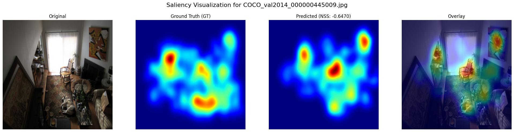
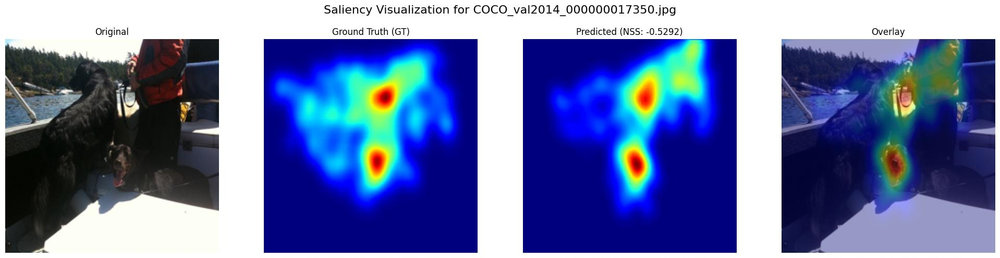
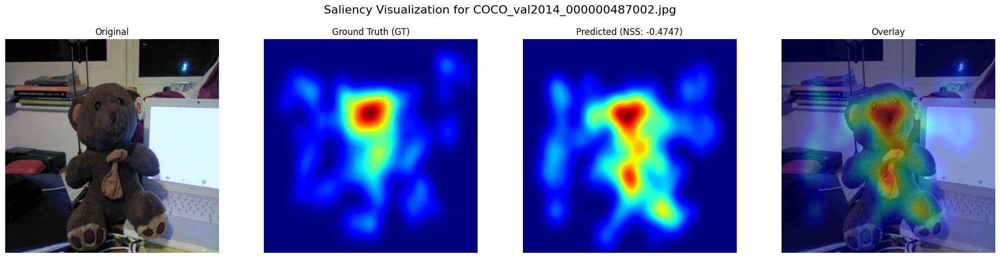
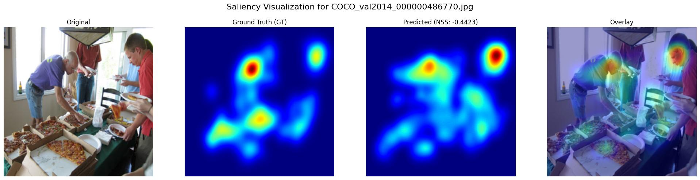

# Saliency GAN

Deep learning model for visual saliency prediction trained on the SALICON dataset.  
The model predicts human attention (saliency maps) for input images using a GAN-based architecture.

---

## Dataset

This project uses the **SALICON dataset** from
https://www.salicon.net/challenge
(Images, Fixations and Fixation Maps).


Dataset structure:

```text
Saliency_GAN/
├── main.py
├── src/
└── data/
    ├── images/
    │   ├── train/
    │   ├── val/
    │   └── test/
    ├── maps/
    │   ├── train/
    │   └── val/
    └── fixations/
        ├── train/
        ├── val/
        └── test/
```
---
## Installation

This project uses **uv** for Python dependency management.

### 1. Install uv

#### Windows (PowerShell)
```bash
pip install uv
uv sync
```
Run the project using:
```bash
uv run main.py -c config.json
```
---
 ## Configuration   
The project is controlled via a JSON configuration file passed with:

```bash
uv run main.py -c config.json
```
#### JSON Structure
```json
{
  "meta": {
    "mode": "train",
    "data_dir": "data",
    "results_dir": "results",
    "checkpoint_dir": "checkpoints"
  },
  "model_config": {
    "img_size": [224, 224],
    "batch_size": 4,
    "lr": 0.0002,
    "num_epochs": 35,
    "early_stop_patience": 7,
    "lambda_l1": 10.0,
    "lambda_kld": 5.0,
    "lambda_tv": 0.001
  },
  "visualization": {
    "visualize_results": true,
    "visualize_single": 2137
  }
}
```
#### meta
Controls the overall pipeline behavior.  
- **mode** – what the program should do: `"train"` (train + evaluate + analyze), `"evaluate"` (only evaluate + analyze), or `null` (skip training/evaluation)  
- **data_dir** – path to the dataset folder (e.g., `"data"`)  
- **results_dir** – folder where results (CSV, images) are saved  
- **checkpoint_dir** – folder where model checkpoints are stored  

#### visualization
Controls visualization behavior.  
- **visualize_results** – if `true`, generates and saves the top 5 best and top 5 worst predictions  (set `null` to disable)  
- **visualize_single** – index of a single image to visualize (set `null` to disable)  
---

## Examples of Saliency Predictions

Below are some examples of saliency visualizations generated by the model, based on **NSS** values.

### Top Predictions






### Worst Predictions






---